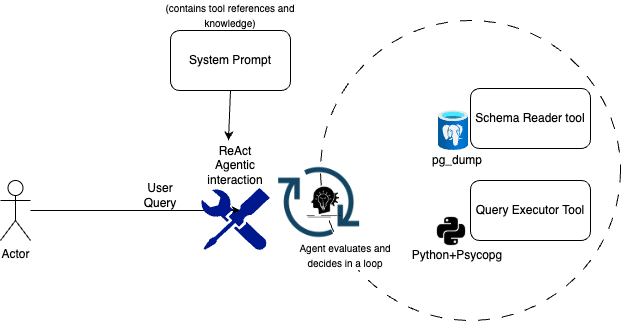

# smol-data-explorer 🚀
A data model exploration tool built with `smolagents` - query your database in plain English!

## Why smol-data-explorer?

The potential of agents and agentic workflows in the current AI landscape is all the rage right now! With more and more announcements, blog posts, ideas, and also concerns, it's hard to not be talking or hearing about agents.

But, what is actually, being done "in the wild", that can be seen as truly useful for existing contexts?

Smol Data Explorer aims to be one of the infinite possible answers to the question above, by giving true "agency" to an LLM, we can do incredible things, and, this repo is just a small example of many amazing things that are possible, and, don't forget, this is as limited as this technology will be and it will only get better from here!

## So, what is it?

In a nutshell, imagine giving an LLM workflow the seamless ability to interact with your data "hands-on": you specify a DB schema, and, if there is a DB in your agent's running environment that knows and uses that schema, your agent can translate plain English questions into executable queries that unlock more insights on your data!

## How does it work?

This first version is very simple:

The agent has two tools at its disposal and, when coupled with a powerful, very directional system prompt, these 
tools can be used to give an LLM a degree of "agency", where it can perform certain actions that traditional LLMs 
wouldn't be able to do, such as, for example, execute a query.

The first tool, "Schema Reader" actually leverages a pg_dump raw SQL file to let the LLM grasp a schema, and bring 
it into context for the LLM.
Then, based on the output of this first tool, the LLM will ReAct (reason and act) by invoking a second tool, "Query 
Executor" that will execute the query, by running Python code, that "lives" in the same environment where the agent 
is running and then, once the result set is brought into the context of the LLM, the final result will be displayed.

## Does the base LLM matter?

Yes, it does! In fact, only LLMs that are optimized for tool calling can be used and, among these, some rank higher than others, due to their "learned abilities" for maintaining context, having a large context window size, and their ability to follow instructions. This trifecta will greatly affect the quality of your agents.

For now, I am using one of the best open-source LLMs for tool calling, `mistral-small` via ollama. You can read more [here](https://www.galileo.ai/blog/agent-leaderboard), thanks to the team from Galileo AI who put up an amazing LLM tool calling leaderboard on HuggingFace.

### Roadmap

- [ ] Evaluate long-context tasks 
- [ ] Try different base models
- [ ] Use a bigger/more complex schema
- [ ] "Inject" steps to better control output formats
- [ ] Use with a front-end client 
